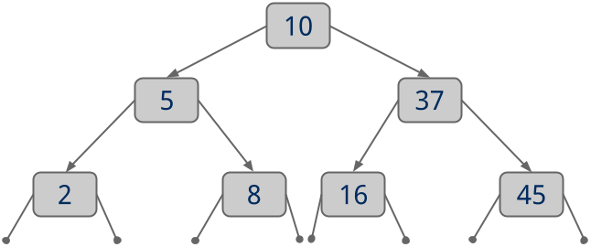

# CS1501 Project 1

## Goal:
To gain a better understanding of tree data structures by implementing a Binary Search Tree (BST)

## Background:
We have discussed BSTs in depth in lecture. Here, you will be implementing a basic BST that supports several methods.
Your BST need only store keys, it does **not** need to store key/value pairs.

## Specifications:
* First, you will need to create a `BST.java` file in `./app/src/main/java/cs1501_p1/`. This file should contain your implementation of a class named `BST` that implements `BST_Inter`, uses `BT_Node` objects as its nodes, and stores generic keys that extend `Comparable` (i.e., defined as `BST<T extends Comparable<T>>`).
* Your `BST` class should implement the following methods:
	* `put()`: Add a new key to the BST
	* `contains()`: Search the BST for a key, return `true` if the key is present, `false` if it is not.
	* `delete()`: Remove a key from the BST
	* `height()`: Return the height of the BST (a single node tree has a height of 1, an empty tree has a height of 0).
	* `isBalanced()`: Return true if the BST is height-balanced, false if it is not 
		(a height balanced binary tree is one where the left and right subtrees of all nodes differ in height by no more than 1)
	* `inOrderTraversal()`: Perform an in-order traversal of the tree and produce a String containing the keys in ascending order, separated by `':'`'s.
		Consider the following example:

		

		Calling `inOrderTraversal()` on this tree should return the String `"2:5:8:10:16:37:45"`.
	* `serialize()`: Perform a pre-order traversal of the BST in order to produce a String representation of the BST.
		The reprsentation should be a comma separated list where each entry represents a single node. Each entry should take the form: *type*(*key*).
		You should track 4 node types:
		* `R`: The root of the tree
		* `I`: An interior node of the tree (e.g., not the root, not a leaf)
		* `L`: A leaf of the tree
		* `X`: A stand-in for a null reference
		For each node, you should list its left child first, then its right child. You do not need to list children of leaves.
		The `X` type is only for nodes that have one valid child. The key for an `X` node should be `NULL` (all caps).
		Consider the following:

		

		Calling `serialize()` on this tree should return the String `"R(10),I(5),L(2),X(NULL),I(37),X(NULL),L(45)"`.
	* `reverse()`: Produce a deep copy of the BST that is reversed (i.e., left children hold keys greater than the current key, 
		right children hold keys less than the current key).
		We do not expect any BSTs returned by `reverse()` to have working `put()`, `contains()`, or `delete()` methods, this is fine.
		Note that a correct implementation of `serialize()` will be needed to verify the results of `reverse()`.

## Submission Guidelines:
* **DO NOT** add the `./app/build/` diectory to your repository.
	* Leave the `./app/build.gradle` file there, however
* Be sure to remember to push the latest copy of your code back to your GitHub
	repository before submitting. To submit, log into GradeScope from Canvas and
	have GradeScope pull your repository from GitHub.

## Additional Notes:
* Don't forget to make `BST.java` a part of the package `cs1501_p1`!
* The default file to run is `App.java`, you can execute this by running
	`./gradlew run` on Linux or macOS. Note that this file doesn't do much. It
	simply instantiates a new `BST` object and exits.
* There a number of tests for your `BST` class in
	`./app/src/test/java/cs1501_p1/BSTTest.java`. Running `./gradlew test` on
	Linux or macOS will run these tests.
* As always, note that we will be grading your project using different tests
	than those that appear in `./app/src/test`. You are encouraged to write
	your own tests to help ensure that your project is working as specified.

## Grading Rubric:
| Feature | Points
| ------- | ------:
| `put()` and `contains()` work as specified | 10
| `delete()` works as specified | 10
| `height()` works as specified | 10
| `isBalanced()` works as specified | 10
| `inOrderTraversal()` works as specified | 15
| `serialize()` works as specified | 20
| `reverse()` works as specified | 20
| Proper assignment submission | 5
